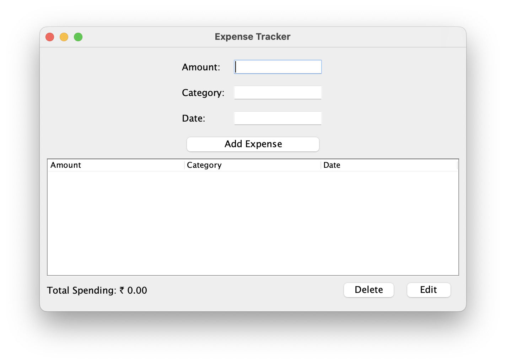
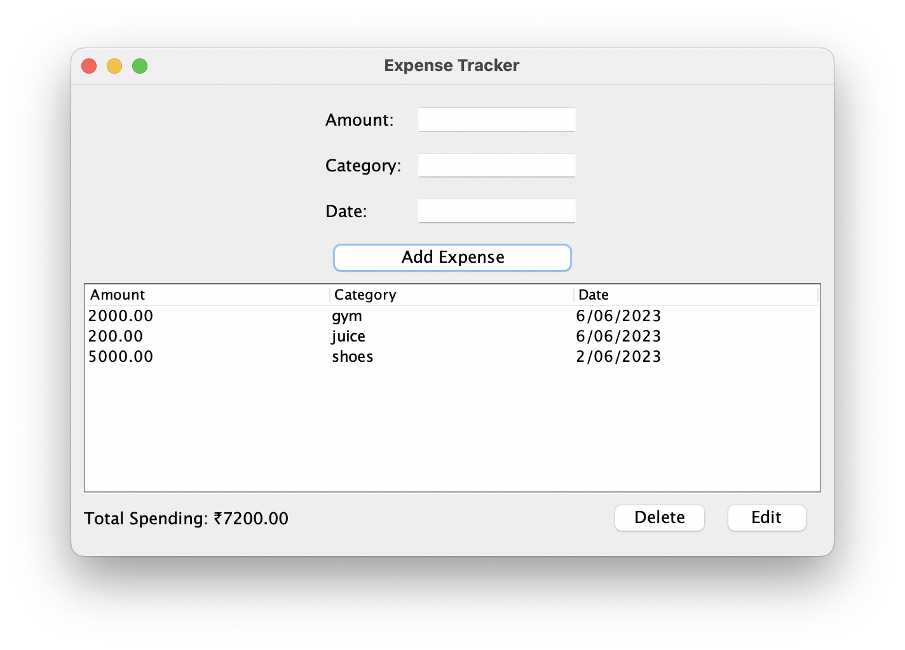

# Expense Tracker App

The Expense Tracker App is a simple application that allows you to track your expenses. You can add, delete, and edit expenses, and the app will calculate and display the total spending.

## Prerequisites

To run the Expense Tracker App, you need to have the following installed:

- Java Development Kit (JDK)
- Java Runtime Environment (JRE)

## Getting Started

To get started with the Expense Tracker App, follow these steps:

1. Clone the repository or download the source code files.
2. Open the project in your preferred Java IDE.
3. Build the project to compile the source code.

## Running the App

To run the Expense Tracker App, follow these steps:

1. Make sure you have built the project successfully.
2. Locate the `ExpenseTrackerApp` class.
3. Run the `main` method in the `ExpenseTrackerApp` class.

## Usage

Once the Expense Tracker App is running, you can perform the following actions:

- **Add Expense**: Enter the amount, category, and date of the expense, and click the "Add Expense" button. The expense will be added to the list.
- **Delete Expense**: Select an expense from the table and click the "Delete" button. The selected expense will be removed from the list.
- **Edit Expense**: Select an expense from the table and click the "Edit" button. A dialog will appear where you can enter a new amount, category, and date for the expense. Click "OK" to update the expense.

The total spending is displayed at the bottom of the app.

## Data Persistence

The Expense Tracker App uses a file-based approach to store and load expenses. The expenses are saved in a text file named `expenses.txt` located in the same directory as the application. When the app starts, it loads the expenses from the file, and when expenses are added, deleted, or edited, the changes are saved back to the file.

## Libraries Used

The Expense Tracker App uses the following libraries:

- `javax.swing`: Used for creating the graphical user interface.
- `java.awt`: Used for layout management and event handling.
- `java.text.DecimalFormat`: Used for formatting the amount in the table.

## Screenshots

## License

This project is licensed under the MIT License. See the [LICENSE](LICENSE) file for details.

